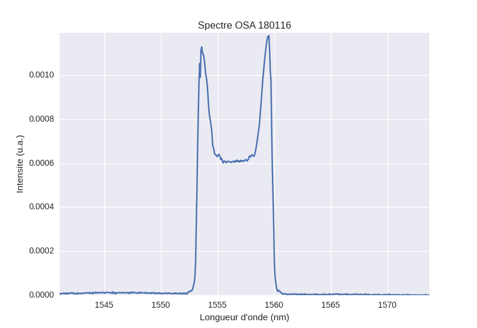
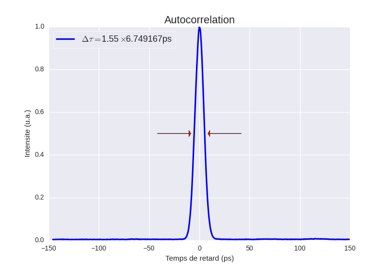
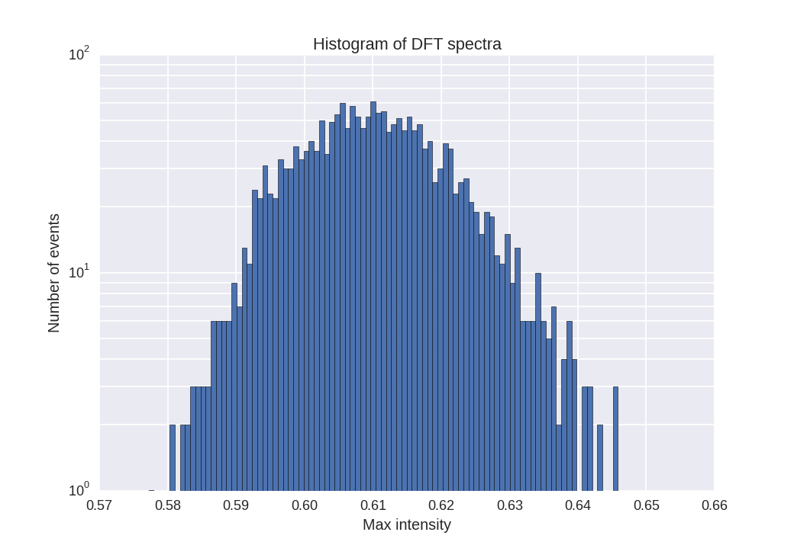

# Plot
This repository gathers mainly Python scripts which are about plotting experimental and numerical data.
Requires : Python 2.7 - NumPy - matplotlib - Tkinter - Seaborn

<h2>Scripts :</h2>

<b>Plot_Experimental.py</b> allows to plot easily data from known devices (Oscilloscope, OSA ...)
The device is automatically detected at the file selection. 
For an autocorrelation plot, a polynomial fit is realised to evaluate the FWHM, and then the pulse duration is determined by dividing by the pulse shape factor.

Code to edit : Autocorrelation parameters at the end. 
result = Autoco(Appareil,data,29.5,1,10,'sech') with 29.5 the conversion factor in ps/ms, 1 the division duration in ms, 10 the number of cases ans sech the shape (can also be gauss).

<b>Plot_DFT_Stats.py</b> is made to plot multiple spectra from a known device and/or an intensity distribution histogram

Code to edit : in the two last lines,
Plot_color(0, 2000, filename, Appareil[1], Appareil[0], 1550, Res_Fibre, +0.25, 'lin')
with 1550 the central wavelength, +0.25 the offset due to temporal shift, lin the scale (can also be log) and 0, 2000 the span of acquisition.
Res_Fibre loads the fiber parameters  (eg Fibre_Besancon()) 
